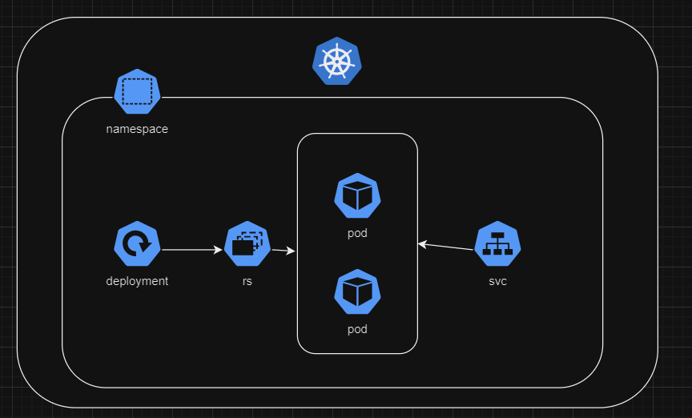

University: [ITMO University](https://itmo.ru/ru/)
Faculty: [FICT](https://fict.itmo.ru)
Course: [Introduction to distributed technologies](https://github.com/itmo-ict-faculty/introduction-to-distributed-technologies)
Year: 2023/2024
Group: K4110c
Author: Urbaev Maxim Gennadievich
Lab: Lab1
Date of create: 13.11.2023
Date of finished: 

# Запуск minikube в docker-контейнере на хостовой ОС windows

minikube kubectl -- expose pod vault --type=NodePort --port=8200

minikube kubectl -- port-forward service/vault 8200:8200

Для получения токена заглянем в логи пода

### Вопросы

1. Был запущен minikube, в котором развернут деплоймент волта, создан сервис и прокинут на локалхост для доступа.
2. k logs pod_name

# Схема

