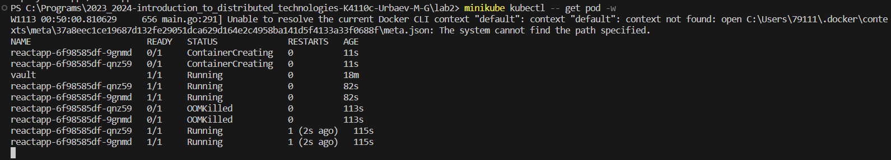
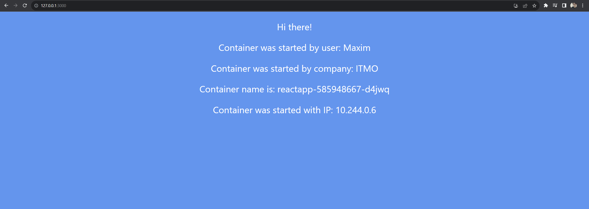
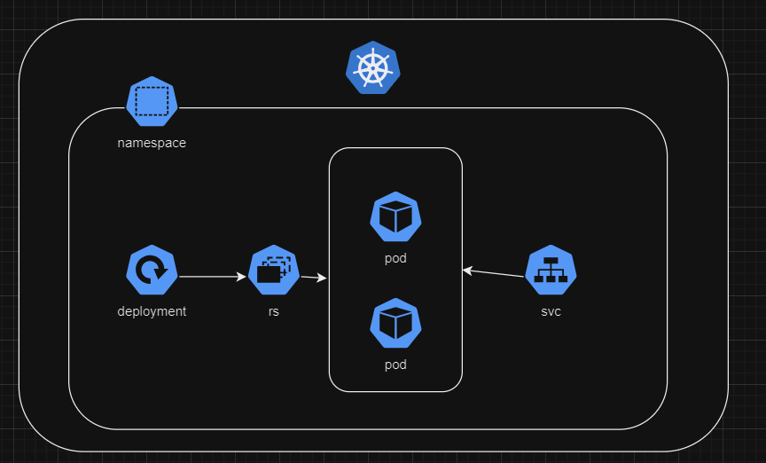

University: [ITMO University](https://itmo.ru/ru/)
Faculty: [FICT](https://fict.itmo.ru)
Course: [Introduction to distributed technologies](https://github.com/itmo-ict-faculty/introduction-to-distributed-technologies)
Year: 2023/2024
Group: K4110c
Author: Urbaev Maxim Gennadievich
Lab: Lab1
Date of create: 13.11.2023
Date of finished: 

# Deployment and Service

kubectl apply -f Deployment.yaml
kubectl apply -f Service.yaml

kubectl port-forward svc/reactapp 3000

На экран выводятся значения переменных, которые были заданы в деплойменте, а также ip-адрес одного из подов, на который приземляется трафик

# Схема

