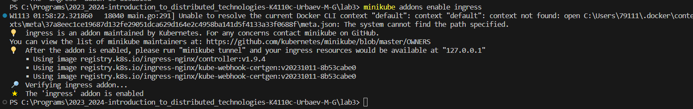
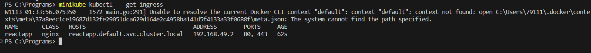
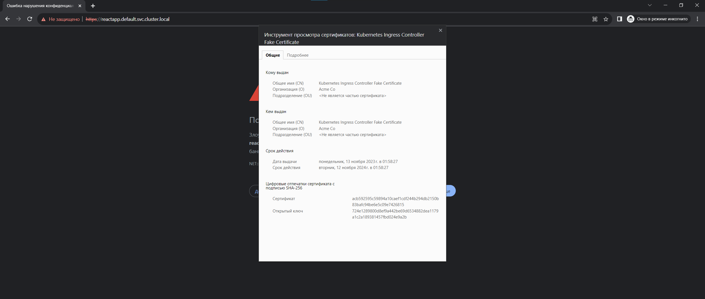
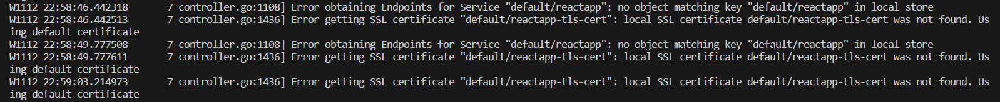
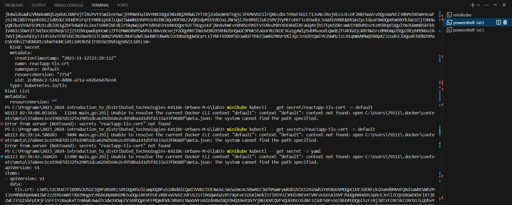
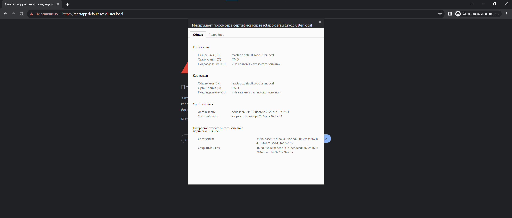
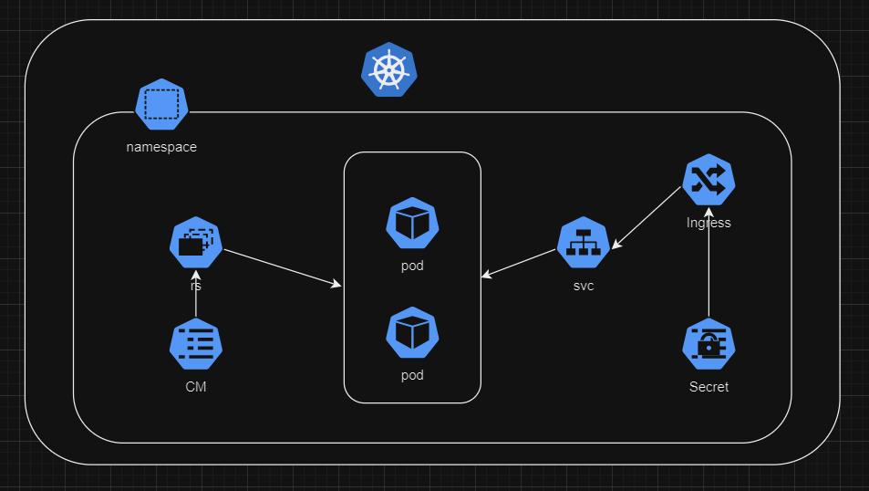

University: [ITMO University](https://itmo.ru/ru/)
Faculty: [FICT](https://fict.itmo.ru)
Course: [Introduction to distributed technologies](https://github.com/itmo-ict-faculty/introduction-to-distributed-technologies)
Year: 2023/2024
Group: K4110c
Author: Urbaev Maxim Gennadievich
Lab: Lab1
Date of create: 13.11.2023
Date of finished: 

# ConfigMap and RS

Были сгенерированы серты и создан секрет с ними (base64 encoded)

Была создана конфигмапа с env'ами

Был написан RS, который тянет значения энвов из CM

Был написан Ingress, который для tls использует данные из ранее созданного секрета

Далее для Minikube нужно было включить addon

minikube tunnel для доступа к ingress на windows

В /etc/hosts была добавлена запись: "127.0.0.1	reactapp.default.svc.cluster.local"

---

Странная багулина: 

(а, не багулина, косяк в нейминге)
---

Передеплоил секрет с namespace:default

# Схема

