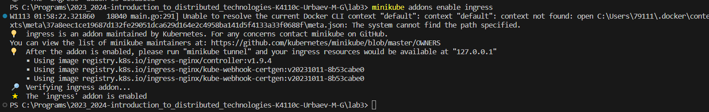
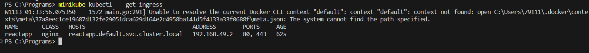
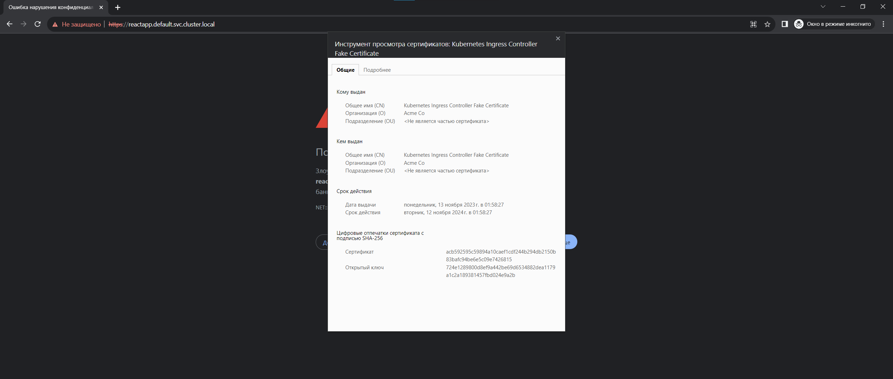
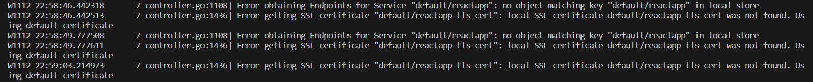
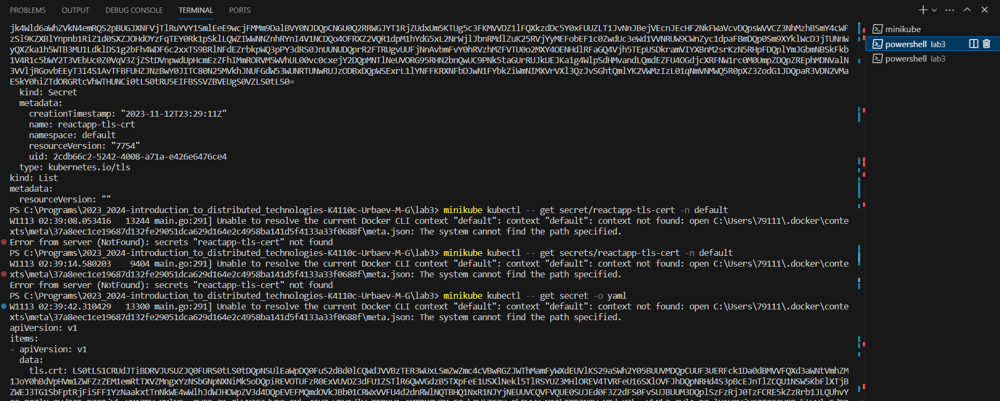
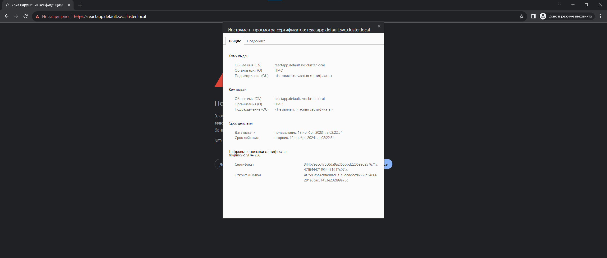

University: [ITMO University](https://itmo.ru/ru/)
Faculty: [FICT](https://fict.itmo.ru)
Course: [Introduction to distributed technologies](https://github.com/itmo-ict-faculty/introduction-to-distributed-technologies)
Year: 2023/2024
Group: K4110c
Author: Urbaev Maxim Gennadievich
Lab: Lab1
Date of create: 13.11.2023
Date of finished: 

# ConfigMap and RS

minikube tunnel

127.0.0.1	reactapp.default.svc.cluster.local

Странная багулина: 

Передеплоил секрет с namespace:default
