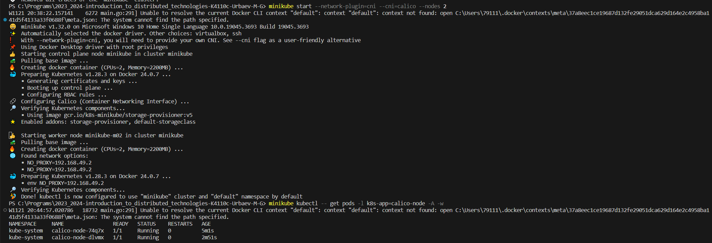
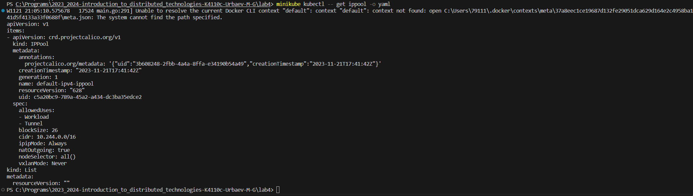
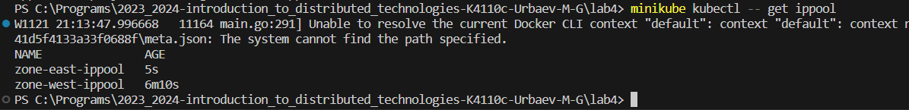
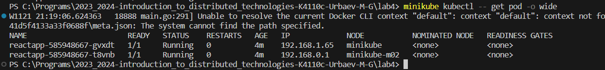
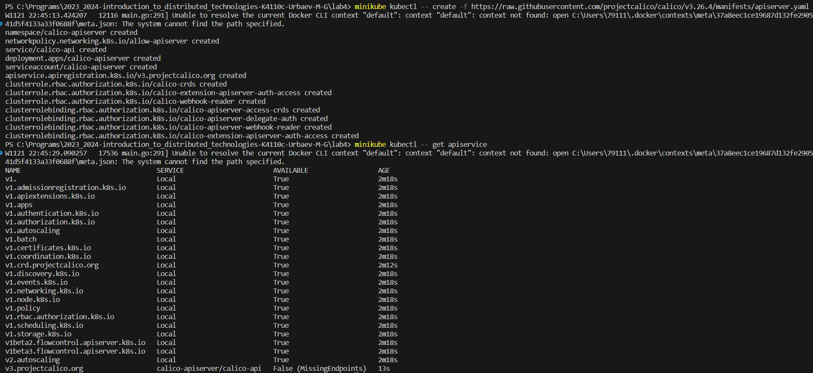
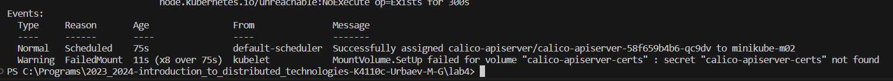
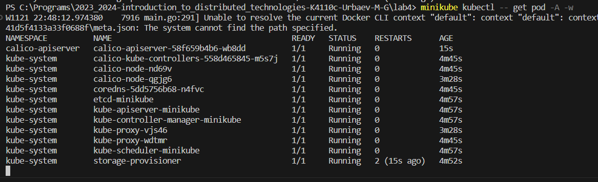
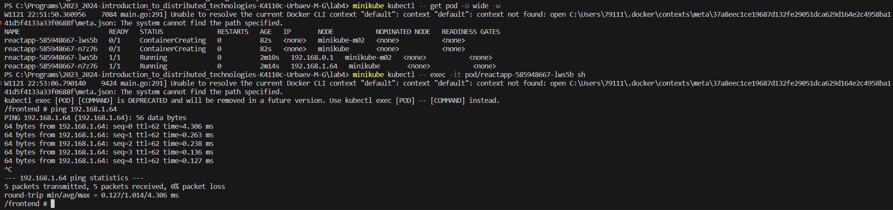
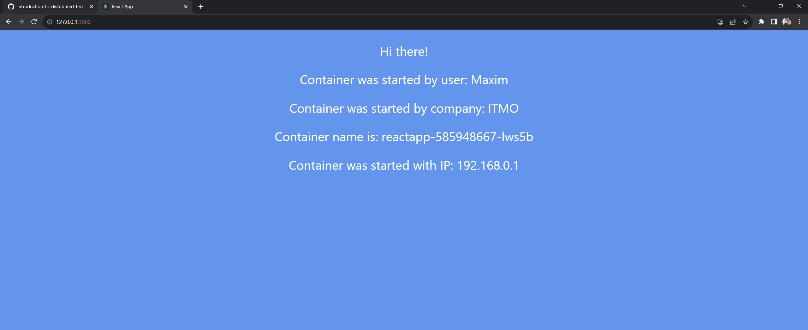
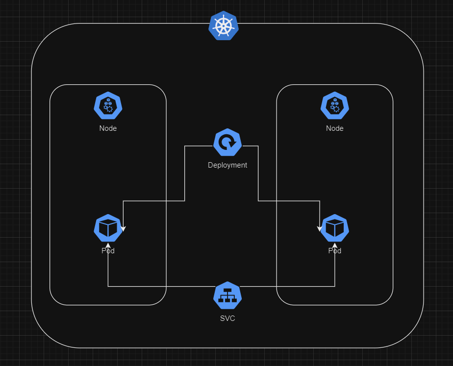

University: [ITMO University](https://itmo.ru/ru/)
Faculty: [FICT](https://fict.itmo.ru)
Course: [Introduction to distributed technologies](https://github.com/itmo-ict-faculty/introduction-to-distributed-technologies)
Year: 2023/2024
Group: K4110c
Author: Urbaev Maxim Gennadievich
Lab: Lab1
Date of create: 13.11.2023
Date of finished: 

# CNI, CoreDNS

minikube start --network-plugin=cni --cni=calico --nodes 2

minikube kubectl -- get pods -l k8s-app=calico-node -A -w

minikube kubectl -- label node minikube zone=east

minikube kubectl -- label node minikube-m02 zone=west

Был найден существующий ippool из которого я нашел нужную crd (c projectcalico.org/v3 манифест не применялся)

minikube kubectl -- delete ippool default-ipv4-ippool

Пинги не проходят

---

Погуглив, в каком то issue нашел ссылку на установку apiserver для calico (https://docs.tigera.io/calico/latest/operations/install-apiserver)

kubectl create -f https://raw.githubusercontent.com/projectcalico/calico/v3.26.4/manifests/apiserver.yaml

openssl req -x509 -nodes -newkey rsa:4096 -keyout apiserver.key -out apiserver.crt -days 365 -subj "/" -addext "subjectAltName = DNS:calico-api.calico-apiserver.svc"

kubectl create secret -n calico-apiserver generic calico-apiserver-certs --from-file=certs/apiserver.key --from-file=certs/apiserver.crt

minikube kubectl -- patch apiservice v3.projectcalico.org --patch-file .\Patch.yaml

api-server pod поднялся (стукнул его после патча)

Результаты:

# Схема

